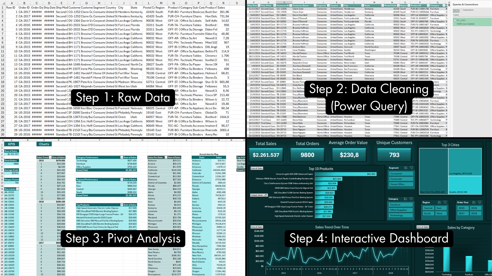

# Retail Sales Performance Analysis | Interactive Excel Dashboard

📊 Excel Dashboard | 📈 Sales Analysis | 🧠 Business Insights

---

## Executive Summary

This project analyzes retail sales data to understand what drives revenue and where performance can be improved.

Using Excel, I cleaned and transformed raw data, built pivot-based analysis, and created an interactive dashboard to track key metrics such as sales, orders, customer behavior, and regional performance.

The analysis revealed clear patterns: sales are heavily concentrated in a few cities like New York and Los Angeles, Technology is the top-performing category, while the South region consistently underperforms. There is also a noticeable drop in sales at the beginning of each year, indicating possible seasonality effects.

These insights can help stakeholders focus on high-performing areas, improve weaker regions, and better plan around seasonal trends.

All analysis and visualization were built entirely in Excel, making the solution easy to use and accessible for everyday business users.

---

## Dashboard Preview

---

## Business Problem

Retail companies generate large amounts of sales data, but without a clear structure it becomes difficult to understand what is really driving performance.

Stakeholders need a simple way to track sales, identify strong and weak areas, and spot trends over time. Without this clarity, it’s hard to make decisions on where to focus, which regions to improve, or which products actually drive revenue.

The goal of this project is to turn raw sales data into a clear and interactive view that supports better, faster decision-making.

---

## Key Insights

- **Sales are highly concentrated in a few cities**, with New York and Los Angeles contributing a significant share of total revenue  
- **Technology is the top-performing category**, outperforming Furniture and Office Supplies  
- **The South region consistently underperforms**, indicating potential gaps in strategy  
- **Sales drop at the beginning of each year**, showing strong seasonality patterns  
- **One product dominates revenue**, significantly outperforming others  

---

## Project Workflow

The project follows a simple end-to-end workflow:

- **Step 1: Raw Data**  
- **Step 2: Data Cleaning (Power Query)**  
- **Step 3: Pivot Analysis**  
- **Step 4: Interactive Dashboard**

---

## Results & Business Recommendations

- **Focus on high-performing cities**  
  Expand efforts in markets similar to New York and Los Angeles  

- **Strengthen underperforming regions**  
  Review strategy and market approach in the South region  

- **Leverage top-performing category**  
  Increase focus on Technology products  

- **Reduce dependency on a single product**  
  Diversify top-performing products  

- **Plan around seasonality**  
  Use campaigns to address early-year sales drop  

---

## Next Steps

- Expand analysis with more recent data  
- Add profitability metrics (profit, margin)  
- Analyze customer behavior and segmentation  
- Test targeted improvements in weak regions  

---

## Dataset
- 9,800 records (transactions)  
- 18 variables covering sales, customers, products, and geography  
- Mix of numerical, categorical, and date features
  
Dataset source:  
https://www.kaggle.com/datasets/rohitsahoo/sales-forecasting

---

## Data Dictionary

A detailed data dictionary is available in the project files:

📄 [Data Dictionary](docs/data_dictionary.xlsx)

---

## Limitations

- Static dataset (no real-time updates)  
- No profitability metrics included  (revenue, profit)
- Single-table dataset limits deeper relational analysis  

---

## Skills

- **Excel:** Pivot Tables, Dashboard Design, Data Analysis  
- **Power Query:** Data Cleaning, Transformation  
- **Data Analysis:** KPI Tracking, Trend Analysis  
